# Relatório Técnico — Aprendizado Supervisionado com Seleção de Features e Otimização de Hiperparâmetros

**Autores:** Gabriel Stiegemeier e Guilherme Einloft
**Disciplina:** Inteligência Artificial
**Dataset:** Pima Indians Diabetes (UCI / OpenML, id=37)

---

## 1. Introdução

O diabetes mellitus tipo 2 constitui uma das doenças crônicas de maior prevalência mundial, e sua detecção precoce é considerada um fator determinante para a redução de complicações clínicas a longo prazo. Nesse contexto, a aplicação de técnicas de aprendizado de máquina a dados clínicos apresenta potencial significativo para auxiliar no diagnóstico automatizado e na identificação de fatores de risco associados à doença.

O presente trabalho tem como objetivo o desenvolvimento de um pipeline completo de Machine Learning aplicado ao dataset *Pima Indians Diabetes*, originalmente coletado pelo National Institute of Diabetes and Digestive and Kidney Diseases (NIDDK) e disponibilizado pelo UCI Machine Learning Repository. O dataset é composto por registros clínicos de mulheres da etnia Pima, com idade igual ou superior a 21 anos, e é amplamente utilizado como benchmark na literatura de classificação médica.

O pipeline abrange as seguintes etapas, conforme estipulado na especificação do trabalho:

1. **Análise exploratória** do dataset, incluindo diagnóstico de valores ausentes, outliers e distribuição de classes.
2. **Pré-processamento** dos dados, com imputação de valores ausentes, codificação de variáveis e escalonamento numérico.
3. **Seleção de features** por meio de Informação Mútua, complementada por análise de interpretabilidade via SHAP.
4. **Classificação binária** com Rede Neural Multicamadas (MLP), com comparação contra modelos clássicos (XGBoost e SVM).
5. **Classificação multiclasse** com MLP, utilizando limiares clínicos da American Diabetes Association (ADA) para categorização do nível glicêmico.
6. **Regressão** com MLP para predição da concentração de glicose plasmática.
7. **Otimização de hiperparâmetros** com o framework Optuna.
8. **Análise de overfitting** e avaliação de técnicas de regularização.

O dataset contém 768 amostras e 8 atributos preditivos numéricos, com a variável alvo de classificação binária indicando a presença (`Outcome = 1`) ou ausência (`Outcome = 0`) de diabetes. Para a tarefa de regressão, foi utilizada a variável `plas` (concentração de glicose plasmática em mg/dL) como alvo contínuo.

---

## 2. Metodologia

### 2.1. Descrição do Dataset

O dataset *Pima Indians Diabetes* (OpenML id=37) possui as seguintes características:

- **Número de amostras:** 768
- **Número de atributos preditivos:** 8
- **Variável alvo (classificação binária):** `Outcome` — diagnóstico de diabetes (0 = negativo, 1 = positivo)
- **Variável alvo (regressão):** `plas` — concentração de glicose plasmática (mg/dL)

Os 8 atributos preditivos são:

| Atributo | Descrição |
|---|---|
| `preg` | Número de gestações |
| `plas` | Concentração de glicose plasmática (mg/dL) |
| `pres` | Pressão arterial diastólica (mm Hg) |
| `skin` | Espessura da dobra cutânea do tríceps (mm) |
| `insu` | Insulina sérica (mu U/mL) |
| `mass` | Índice de massa corporal (kg/m²) |
| `pedi` | Função de pedigree de diabetes |
| `age` | Idade (anos) |

**Distribuição das classes (classificação binária):**

A classe negativa (0) corresponde a 500 amostras (65,1%) e a classe positiva (1) a 268 amostras (34,9%), resultando em uma razão de desbalanceamento de aproximadamente 0,54. Embora não se configure um desbalanceamento extremo, foi utilizado o parâmetro `class_weight="balanced"` nos modelos aplicáveis para mitigar qualquer viés em favor da classe majoritária.

#### 2.1.1. Problemas Identificados

**Valores ausentes codificados como zero:** Cinco atributos (`plas`, `pres`, `skin`, `insu` e `mass`) apresentaram valores zero biologicamente impossíveis. A coluna `insu` foi a mais afetada, com 48,7% de zeros inválidos, seguida por `skin` (29,6%), `plas` (0,7%), `pres` (4,6%) e `mass` (1,4%). Esses zeros foram tratados como valores ausentes.

**Outliers:** A análise por IQR identificou outliers em múltiplas variáveis, com destaque para `insu` (34 outliers), `pedi` (29 outliers) e `mass` (19 outliers). A análise complementar por Z-score (|z| > 3) confirmou a presença de valores extremos nessas mesmas variáveis.

**Correlação entre atributos:** Nenhum par de features apresentou correlação superior a |r| = 0,7, o que indica ausência de multicolinearidade severa. As correlações mais relevantes observadas foram entre `skin` e `insu` (r = 0,44) e entre `mass` e `skin` (r = 0,39).

### 2.2. Divisão Treino/Teste e Pré-processamento (Etapa 2)

O pré-processamento dos dados envolveu três operações principais: tratamento de valores ausentes, verificação de codificação de variáveis categóricas e escalonamento numérico. Para evitar o fenômeno de *data leakage* (vazamento de dados), o conjunto original foi inicialmente dividido em treino (80%, 614 amostras) e teste (20%, 154 amostras), com estratificação pela variável alvo. Todas as operações de imputação e escalonamento foram ajustadas (fit) exclusivamente no conjunto de treino, sendo então aplicadas (transform) ao conjunto de teste.

#### 2.2.1. Tratamento de Valores Ausentes — KNN Imputer (k=5)

Os zeros biologicamente inválidos nas colunas `plas`, `pres`, `skin`, `insu` e `mass` foram substituídos por `NaN` e, em seguida, imputados via KNN Imputer com k=5 vizinhos.

A escolha do KNN Imputer, em detrimento da imputação univariada simples (mediana ou média), foi motivada pela necessidade de preservar a estrutura multivariada dos dados. A imputação por mediana ignora as correlações entre os atributos: por exemplo, `skin` e `insu` possuem correlação positiva de r=0,44 e `mass` e `skin` possuem r=0,39. Um valor imputado para `skin` deve, portanto, considerar as informações contidas em `insu` e `mass`.

O KNN Imputer utiliza os k vizinhos mais próximos, medidos pela distância euclidiana no espaço das features não ausentes, para estimar o valor faltante. O valor k=5 é um padrão robusto: suficientemente grande para suavizar o ruído, mas pequeno o bastante para capturar padrões locais nos dados.

Após a imputação, foi verificado que nenhum valor `NaN` remanescente existia no dataset (asserção programática: `nan_after == 0`).

#### 2.2.2. Codificação de Variáveis Categóricas

Todos os 8 atributos preditivos são numéricos (contínuos ou discretos), e a variável alvo de classificação (`Outcome`) já se encontra codificada como inteiro (0/1). Portanto, não houve necessidade de aplicar One-Hot Encoding ou Label Encoding. Caso o dataset contivesse variáveis categóricas nominais (sem ordem inerente), seria aplicado One-Hot Encoding para evitar a imposição de uma ordem artificial. Para variáveis ordinais, Label Encoding ou Ordinal Encoding seriam adequados.

#### 2.2.3. Escalonamento Numérico — RobustScaler

Três opções de escalonamento foram avaliadas:

1. **StandardScaler (Z-score):** Assume distribuição aproximadamente normal. É altamente sensível a outliers, pois a média e o desvio padrão são severamente afetados por valores extremos.
2. **MinMaxScaler:** Mapeia os dados para o intervalo [0, 1]. É extremamente sensível a outliers, pois os limites máximo e mínimo podem ser valores atípicos isolados.
3. **RobustScaler:** Utiliza a mediana e o intervalo interquartil (IQR = Q3 − Q1).

Optou-se pelo **RobustScaler** por ser robusto a outliers. A mediana e o IQR são estatísticas resistentes — a mediana possui ponto de ruptura de 50%, contra 0% da média. Considerando que variáveis como `insu` (34 outliers por IQR), `pedi` (29 outliers) e `mass` (19 outliers) apresentam caudas longas e distribuições assimétricas, o RobustScaler preserva a estrutura dos dados sem que os outliers distorçam a escala das features.

### 2.3. Seleção de Features (Etapa 3)

#### 2.3.1. Informação Mútua — Método Filtro

A técnica de seleção de atributos empregada foi a Informação Mútua (MI), um método filtro que mede a dependência estatística entre duas variáveis. Três propriedades justificam essa escolha:

1. **Captura de dependências não lineares:** Ao contrário da correlação de Pearson, que mede apenas relações lineares, a MI detecta qualquer tipo de dependência estatística. Em dados clínicos, as relações fisiológicas são frequentemente complexas e não lineares, tornando essa propriedade particularmente relevante.
2. **Independência do modelo (model-agnostic):** Sendo um método filtro, a MI é independente do modelo a ser treinado. Isso evita viés circular — usar o mesmo modelo para selecionar features e, em seguida, avaliá-las — e garante que as features selecionadas beneficiem qualquer algoritmo subsequente.
3. **Eficiência computacional:** A complexidade é consideravelmente menor quando comparada a métodos wrapper como Recursive Feature Elimination com validação cruzada.

Para estabilizar as estimativas de MI (que dependem de aleatoriedade interna do estimador KNN utilizado pelo scikit-learn), foram executadas 50 rodadas com sementes aleatórias distintas, e os scores finais foram calculados como a média dessas execuções.

Os scores médios de MI obtidos para cada atributo são apresentados na tabela abaixo:

| Rank | Feature | MI médio | Desvio padrão |
|---|---|---|---|
| 1 | `plas` | 0,1329 | ±0,0088 |
| 2 | `insu` | 0,1293 | ±0,0049 |
| 3 | `mass` | 0,0950 | ±0,0079 |
| 4 | `age` | 0,0555 | ±0,0180 |
| 5 | `skin` | 0,0420 | ±0,0123 |
| 6 | `preg` | 0,0228 | ±0,0153 |
| 7 | `pres` | 0,0201 | ±0,0164 |
| 8 | `pedi` | 0,0124 | ±0,0041 |

- **Quantidade inicial de atributos:** 8
- **Critério de seleção:** Features com MI acima da média geral dos scores (limiar = 0,0638).
- **Quantidade final de atributos selecionados:** 3
- **Features selecionadas:** `plas`, `insu`, `mass`
- **Features descartadas:** `age`, `skin`, `preg`, `pres`, `pedi` (5 features)

#### 2.3.2. Avaliação Comparativa — Todas as Features vs. Features Selecionadas

Para avaliar o impacto da seleção de features sem incorrer em *data leakage*, a avaliação comparativa foi implementada com **seleção de features dentro de cada fold da validação cruzada**. Para o cenário com features selecionadas, cada fold calcula a MI exclusivamente sobre os dados de treino do próprio fold, seleciona as features que superam o limiar (MI > média), e treina e avalia o modelo somente com essas features. Os dados de validação do fold nunca influenciam a seleção. Esse procedimento garante que cada predição de validação seja feita com um conjunto de features escolhido sem acesso ao respectivo dado de validação.

O modelo base utilizado foi Random Forest (`n_estimators=100`, `class_weight="balanced"`, `random_state=42`) com validação cruzada estratificada de 10 folds em dois cenários: (a) com todas as 8 features e (b) com features selecionadas por MI dentro de cada fold.

A análise comparativa incluiu os seguintes critérios:

- **Desempenho:** Métricas como Accuracy, Precision, Recall, F1-Score e ROC-AUC.
- **Redução de overfitting:** Comparação entre a diferença de Accuracy no treino e no teste (gap de generalização) em ambos os cenários.
- **Tempo de treinamento:** Redução no custo computacional ao utilizar um subconjunto reduzido de features.
- **Interpretabilidade:** Com menos atributos, o modelo resultante é mais facilmente interpretável por especialistas do domínio.

#### 2.3.3. Interpretabilidade via SHAP (Extra)

A biblioteca SHAP (SHapley Additive Explanations) foi utilizada para interpretar as decisões de um modelo Random Forest treinado com todas as features. O `TreeExplainer` foi empregado, por ser exato para modelos baseados em árvores.

Foram geradas as seguintes análises:

- **Importância global:** SHAP Summary Plot (beeswarm) e SHAP Bar Plot, indicando quais atributos exercem maior influência nas predições.
- **Explicação local:** Waterfall plots para uma amostra da classe positiva (diabética) e uma da classe negativa, mostrando a contribuição individual de cada feature para a predição específica.
- **Comparação MI vs. SHAP:** Correlação de Spearman entre os rankings de importância gerados pela Informação Mútua e pelo SHAP, avaliando a concordância entre os dois métodos.

### 2.4. Classificação Binária com MLP (Etapa 4)

#### 2.4.1. Arquitetura da MLP

A arquitetura da MLP para classificação binária foi definida com base nos seguintes critérios:

| Hiperparâmetro | Valor | Justificativa |
|---|---|---|
| Camadas ocultas | (64, 32, 16) | Pirâmide decrescente — regularização implícita |
| Função de ativação | ReLU | Evita vanishing gradient |
| Otimizador | Adam | Combina momentum e RMSProp com adaptação automática da taxa de aprendizado |
| Taxa de aprendizado | 0,001 | Valor padrão estável para o Adam |
| Épocas máximas | 500 | Limite superior; early stopping controla a parada efetiva |
| Batch size | 32 | Mini-batch adequado ao volume de dados |
| Early stopping | Sim | Paciência de 30 épocas, fração de validação de 15% |

**Justificativa da arquitetura:**

- **Tamanho do dataset:** 768 amostras é um volume relativamente pequeno para deep learning. Redes muito profundas ou largas causariam overfitting severo rapidamente.
- **Dimensionalidade:** Com apenas 3 features selecionadas (`plas`, `insu`, `mass`), a capacidade necessária da rede é limitada. Uma rede com 3 camadas ocultas (64 → 32 → 16) oferece flexibilidade suficiente para capturar interações não lineares sem excesso de parâmetros.
- **Pirâmide decrescente:** A redução progressiva de neurônios (64 → 32 → 16) é uma heurística clássica que força a rede a aprender representações cada vez mais compactas, atuando como uma forma de regularização implícita.
- **Total de parâmetros:** A rede possui aproximadamente 3.500 parâmetros treináveis, mantendo um número muito inferior ao total de amostras de treino para evitar memorização.

A divisão dos dados seguiu a proporção 80% treino / 20% teste, com estratificação pela variável alvo, garantindo a manutenção da proporção de classes em ambos os conjuntos.

#### 2.4.2. Comparação com Modelos Clássicos (Extra)

Para contextualizar o desempenho da MLP, dois modelos clássicos foram treinados e avaliados nas mesmas condições:

- **XGBoost:** `n_estimators=100`, `max_depth=5`, `learning_rate=0.1`.
- **SVM (kernel RBF):** `C=1.0`, `gamma="scale"`, `class_weight="balanced"`.

Além da avaliação no conjunto de teste (hold-out), foi realizada validação cruzada estratificada de 10 folds para os três modelos, com métricas de Accuracy, F1-Score e ROC-AUC.

### 2.5. Classificação Multiclasse com MLP (Etapa 4b)

Para a tarefa de classificação multiclasse, foi criada uma variável alvo derivada dos limiares clínicos da American Diabetes Association (ADA) para glicose plasmática em jejum:

| Classe | Rótulo | Critério |
|---|---|---|
| 0 | Normal | glicose < 100 mg/dL |
| 1 | Pré-diabético | 100 ≤ glicose < 140 mg/dL |
| 2 | Diabético | glicose ≥ 140 mg/dL |

Os limiares foram aplicados sobre os valores originais (não escalonados) da variável `plas`. As features utilizadas para a classificação multiclasse foram todas as colunas do dataset exceto `plas` (que define o target), incluindo `Outcome` como feature — uma vez que este reflete um diagnóstico independente (baseado no Oral Glucose Tolerance Test), distinto da glicose de jejum.

A arquitetura da MLP multiclasse seguiu a mesma configuração da binária: 3 camadas ocultas (64 → 32 → 16), ReLU, Adam, early stopping com 30 épocas de paciência e batch size de 32. A camada de saída possui 3 neurônios (um por classe), com softmax implícito na implementação do `MLPClassifier` do scikit-learn.

### 2.6. Regressão com MLP (Etapa 5)

#### 2.6.1. Arquitetura da MLP de Regressão

| Hiperparâmetro | Valor | Justificativa |
|---|---|---|
| Camadas ocultas | (64, 32) | Funil clássico; menos camadas que a classificação para evitar memorização |
| Função de ativação | ReLU | Padrão para manter não linearidades ativas e evitar vanishing gradient |
| Otimizador | Adam | Adaptação automática da taxa de aprendizado |
| Taxa de aprendizado | 0,001 | Valor padrão estável |
| Épocas máximas | 1.000 | Limite superior ampliado para regressão |
| Batch size | 32 | Mini-batch adequado ao volume |
| Early stopping | Sim | Paciência de 20 épocas, fração de validação de 15% |

**Justificativa:** Modelos de regressão frequentemente necessitam de menos camadas do que modelos de classificação para evitar memorização excessiva, mantendo um funil clássico e contínuo. O early stopping, habilitado com paciência de 20 épocas, interrompe o treinamento assim que o erro de validação para de melhorar, prevenindo o overfitting e preservando o modelo com a melhor capacidade de generalização.

A variável alvo para regressão foi a concentração de glicose plasmática (`plas`) nos valores originais (não escalonados, em mg/dL), para que as métricas de erro (MAE, RMSE) sejam interpretáveis na unidade clínica. As features de entrada foram as demais variáveis do dataset escalonado.

### 2.7. Otimização de Hiperparâmetros com Optuna (Etapa 6)

O framework Optuna foi utilizado para otimizar os hiperparâmetros da MLP de classificação binária. O espaço de busca definido foi:

| Hiperparâmetro | Espaço de Busca |
|---|---|
| Número de camadas ocultas | 1 a 3 |
| Neurônios por camada | 16 a 128 (passo de 16) |
| Taxa de aprendizado | 1×10⁻⁴ a 1×10⁻² (escala logarítmica) |
| Função de ativação | `relu`, `tanh` |
| Alpha (L2) | 1×10⁻⁵ a 1×10⁻² (escala logarítmica) |

- **Número de trials:** 30
- **Função objetivo:** Maximização do ROC-AUC via validação cruzada de 5 folds.
- **Otimizador base:** Adam com `max_iter=300` e early stopping habilitado.

Os resultados do Optuna foram comparados com o modelo MLP original (Etapa 4) no conjunto de teste para avaliar os ganhos de desempenho.

### 2.8. Regularização e Análise de Overfitting (Etapa 7)

Para investigar o comportamento da MLP em relação ao overfitting, foram treinados dois modelos contrastantes:

**Modelo sem regularização (propenso a overfitting):**
- Arquitetura ampla: (256, 128, 64) — 3 camadas com elevado número de neurônios.
- `alpha = 0.0` — sem penalização L2.
- `n_iter_no_change = 500` — early stopping efetivamente desabilitado, forçando o treinamento a prosseguir por todas as 500 épocas.

**Modelo com regularização:**
- Arquitetura simplificada: (64, 32) — 2 camadas com menos neurônios (regularização estrutural).
- `alpha = 0.01` — penalização L2 ativa, forçando pesos menores e mais distribuídos.
- `n_iter_no_change = 15` — early stopping agressivo, interrompendo o treinamento após 15 épocas sem melhora na validação.

As três estratégias de regularização aplicadas no modelo regularizado foram:

1. **Simplificação estrutural:** Redução de (256, 128, 64) para (64, 32). Menos neurônios implicam menor capacidade de memorização da rede.
2. **Regularização L2 (alpha=0.01):** Penalização de pesos elevados durante o treinamento, forçando a rede a utilizar pesos menores e mais distribuídos, o que suaviza a fronteira de decisão.
3. **Early Stopping:** Monitoramento da acurácia de validação com paciência de 15 épocas, congelando os pesos no ponto de melhor generalização.

---

## 3. Resultados e Discussão

### 3.1. Análise Exploratória (Etapa 1)

A análise exploratória revelou as características fundamentais do dataset. A Figura 1 apresenta a distribuição de todos os atributos, onde se observam picos em zero para as variáveis `plas`, `pres`, `skin`, `insu` e `mass` — confirmando a presença de valores ausentes codificados como zero.

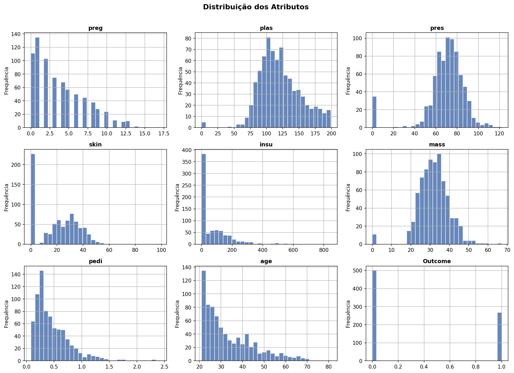

A Figura 2 exibe os boxplots por classe (Outcome), evidenciando que variáveis como `plas`, `mass` e `age` apresentam distribuições visivelmente distintas entre as classes positiva e negativa, sugerindo poder discriminativo relevante.

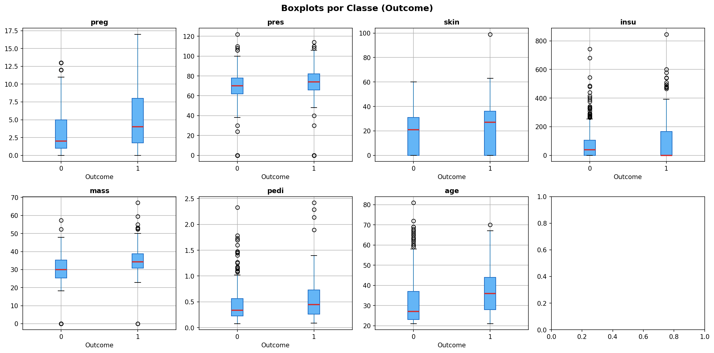

A Figura 3 apresenta a matriz de correlação de Pearson, na qual se observa a ausência de multicolinearidade severa (nenhum par com |r| > 0,7). As correlações mais relevantes são entre `skin` e `insu` (r = 0,44) e entre `age` e `preg` (r = 0,54).

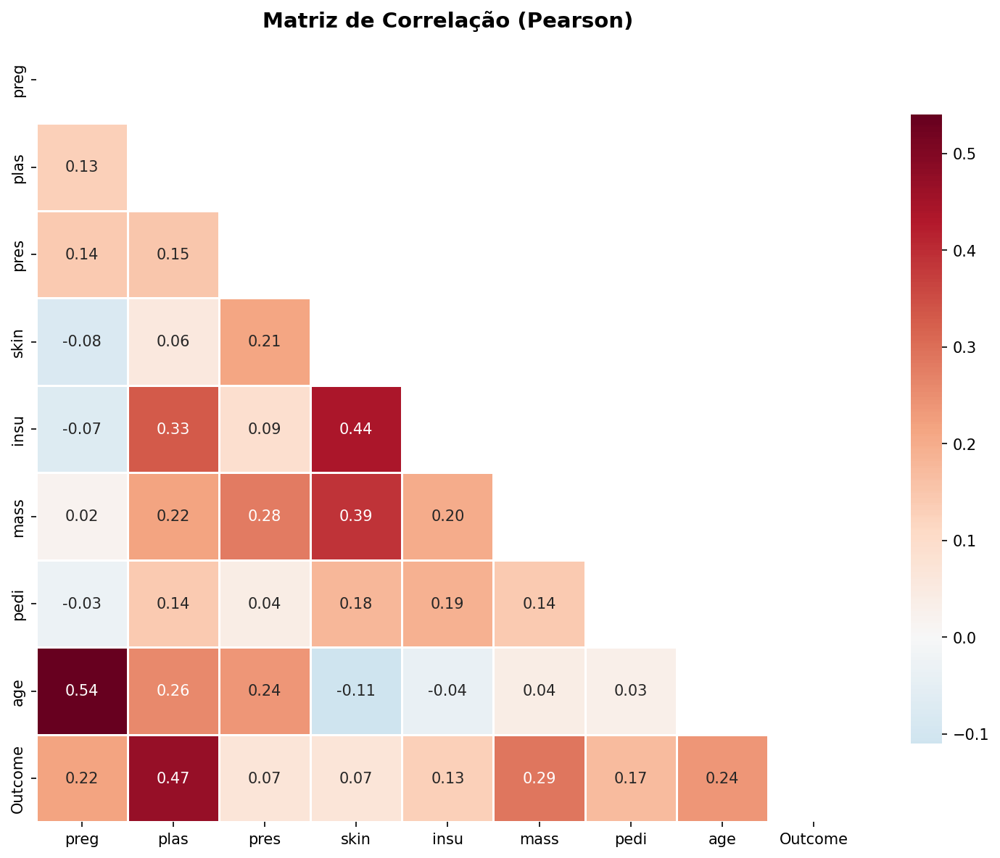

A variável de regressão (`plas`) apresenta distribuição com leve assimetria positiva, conforme ilustrado na Figura 4. O Q-Q Plot indica um desvio da normalidade nas caudas, especialmente na cauda superior.

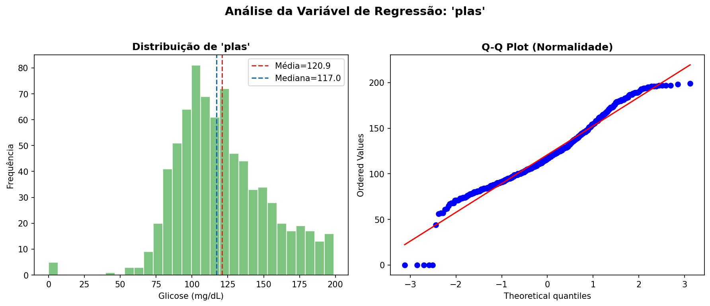

A distribuição da variável alvo de classificação binária é mostrada na Figura 5, com 500 amostras negativas e 268 positivas.

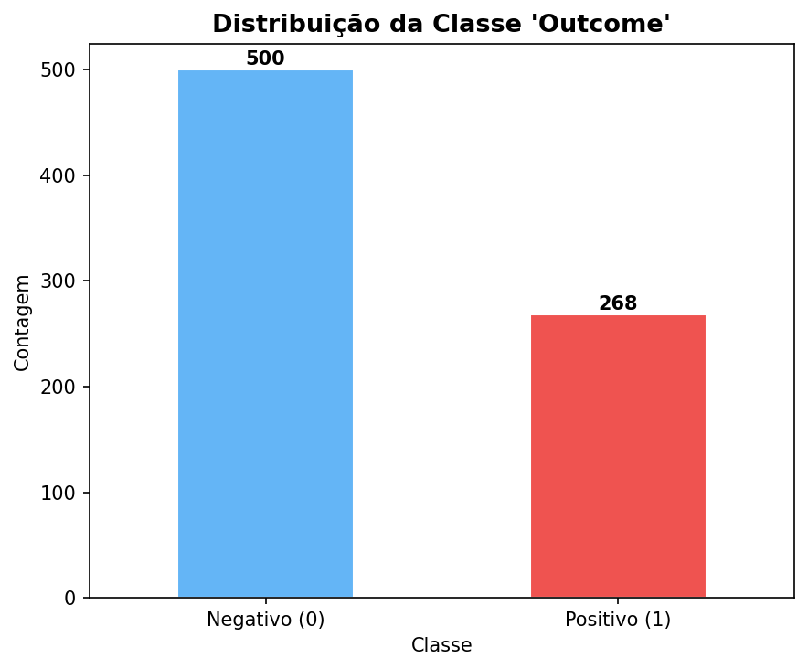

### 3.2. Pré-processamento (Etapa 2)

A Figura 6 compara as distribuições dos 5 atributos afetados antes (com zeros inválidos) e após a imputação por KNN. Observa-se que a imputação eliminou os picos artificiais em zero, especialmente visíveis em `insu` e `skin`, preservando a forma geral das distribuições.

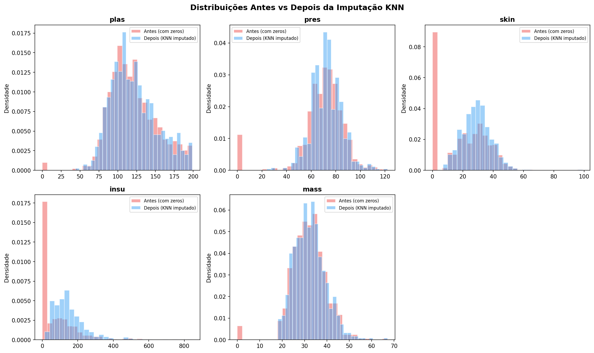

A Figura 7 apresenta os boxplots antes e após o escalonamento com RobustScaler. Após o escalonamento, todas as features estão centradas na mediana (valor 0) com dispersão proporcional ao IQR, permitindo que algoritmos sensíveis à escala (como MLPs e SVMs) operem de forma adequada.

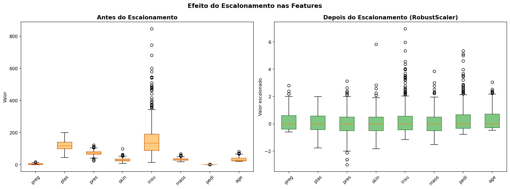

A Figura 8 exibe a matriz de correlação pós-processamento, confirmando que as relações estruturais entre os atributos foram preservadas pelo pipeline de pré-processamento.

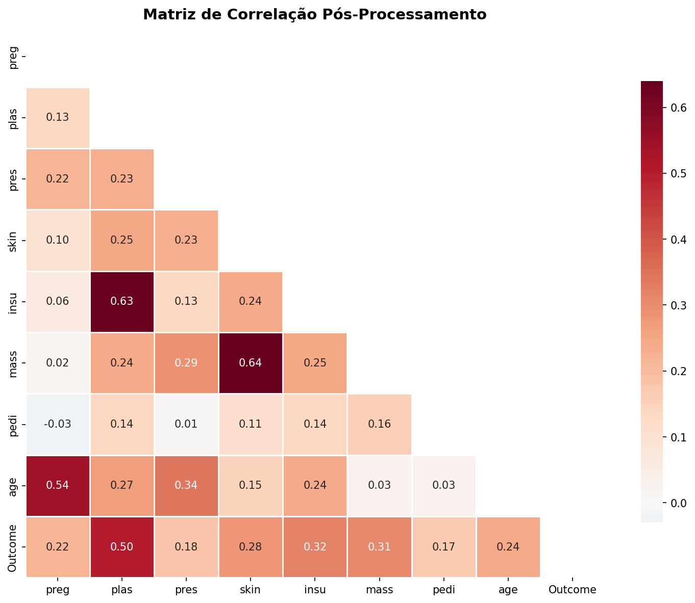

### 3.3. Seleção de Features e Interpretabilidade (Etapa 3)

#### 3.3.1. Análise SHAP — Importância Global

A Figura 9 apresenta o SHAP Summary Plot (beeswarm), que exibe a distribuição dos valores SHAP para cada feature ao longo de todas as amostras. Valores SHAP positivos empurram a predição em direção à classe positiva (diabética), enquanto valores negativos empurram em direção à classe negativa.

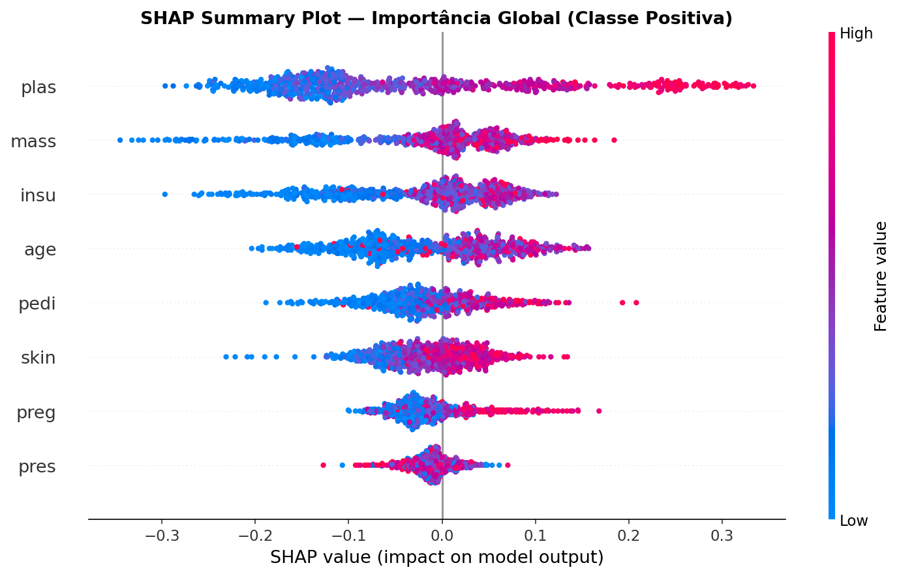

A Figura 10 complementa a análise com o SHAP Bar Plot, que mostra a importância média absoluta de cada atributo.

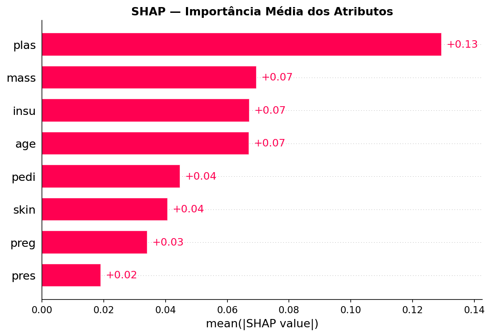

#### 3.3.2. Explicação Local — Predições Individuais

As Figuras 11 e 12 apresentam os waterfall plots do SHAP para uma amostra da classe positiva e uma da classe negativa, respectivamente. Esses gráficos decompõem a predição individual em contribuições aditivas de cada feature, partindo do valor base (predição média do modelo) até a predição final.

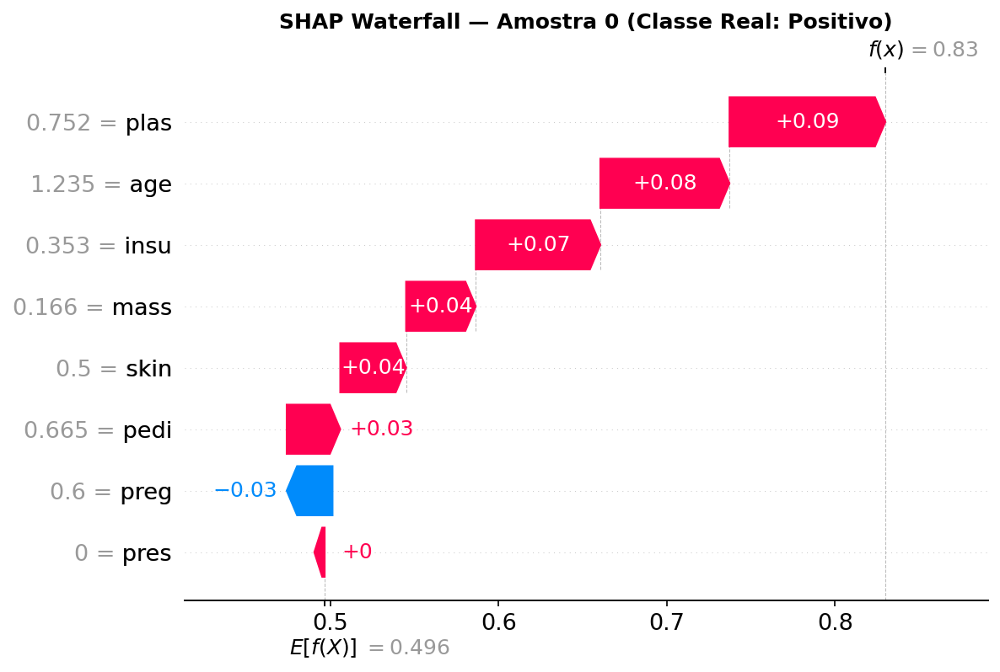

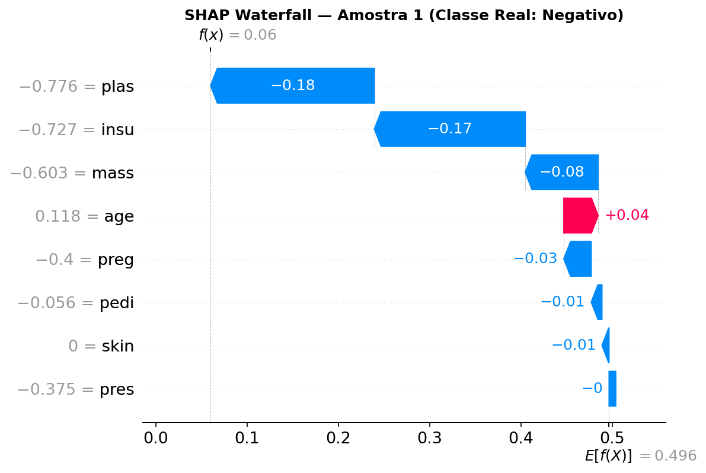

#### 3.3.3. Comparação MI vs. SHAP

A Figura 13 exibe lado a lado os rankings de importância gerados pela Informação Mútua e pelo SHAP. As barras coloridas representam as features selecionadas pela MI (acima do limiar), enquanto as barras cinzas representam as features descartadas.

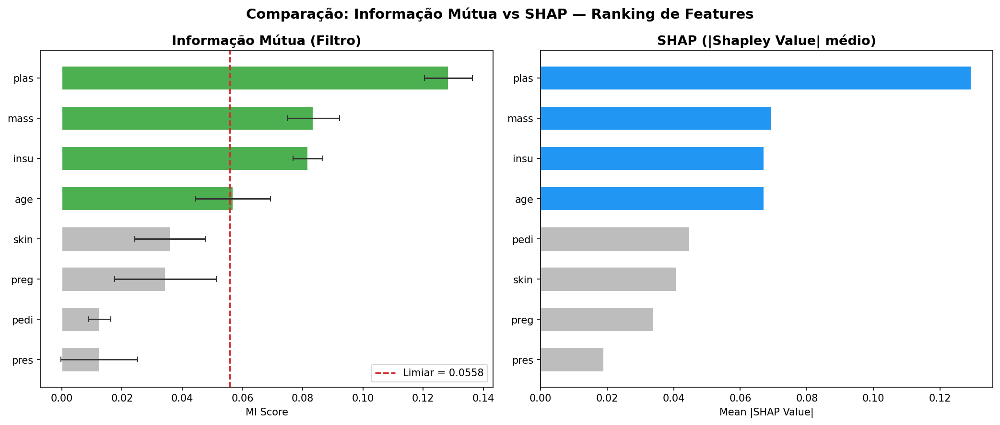

A concordância entre os dois métodos foi avaliada por meio da correlação de Spearman entre os rankings. O coeficiente obtido foi **ρ = 0,9286 (p = 0,0009)**, indicando concordância muito alta e estatisticamente significativa entre os dois métodos. As três features globalmente selecionadas pela MI (`plas`, `insu`, `mass`) pertencem simultaneamente ao topo do ranking SHAP, corroborando a validade da seleção.

#### 3.3.4. Impacto da Seleção de Features (MI dentro da CV)

A Figura 14 apresenta a comparação de desempenho entre os dois cenários, com a seleção MI realizada **dentro de cada fold** para garantir ausência de data leakage.

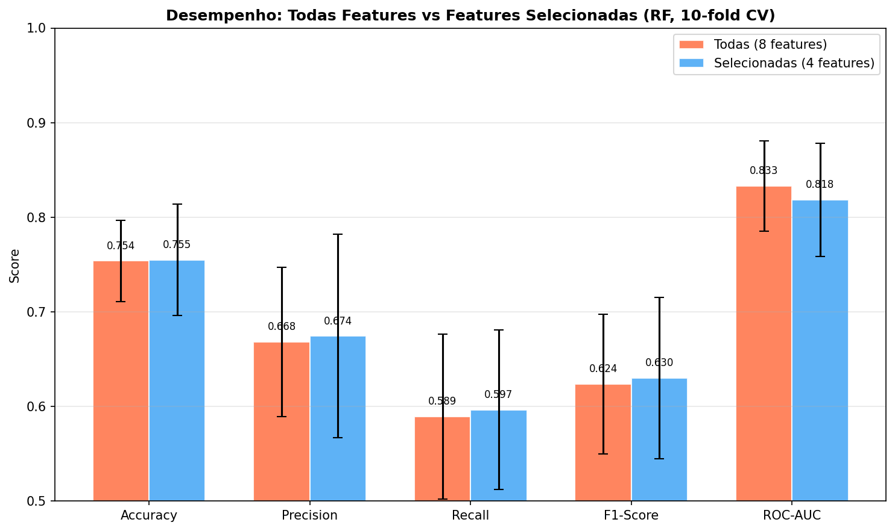

**Consistência da seleção por fold:** As features `plas`, `insu` e `mass` foram selecionadas em todos os 10 folds (10/10), confirmando que são atributos robustamente relevantes independentemente da partição dos dados. A feature `age` foi selecionada em apenas 2/10 folds, evidenciando que sua relevância é limítrofe e sensível à composição dos dados de treino.

**Métricas comparativas (10-fold CV estratificada):**

| Métrica | Todas (8 feat.) | Selecionadas (3 feat.) | Δ |
|---|---|---|---|
| Accuracy | 0,7476 ± 0,0478 | 0,7297 ± 0,0430 | −0,0179 |
| Precision | 0,6338 ± 0,0729 | 0,6080 ± 0,0634 | −0,0258 |
| Recall | 0,6636 ± 0,0710 | 0,6500 ± 0,0676 | −0,0136 |
| F1-Score | 0,6471 ± 0,0658 | 0,6264 ± 0,0539 | −0,0207 |
| ROC-AUC | 0,8259 ± 0,0488 | 0,7957 ± 0,0380 | −0,0302 |

**Gap de overfitting (acurácia treino − teste):**
- Todas as features: **0,2521**
- Features selecionadas: **0,2694**

Os resultados, agora avaliados sem data leakage, revelam um quadro mais realista: o modelo com 3 features selecionadas apresenta desempenho ligeiramente inferior ao modelo com todas as 8 features em todas as métricas. Isso é esperado — a avaliação anterior (com MI calculada fora da CV) inflava artificialmente as métricas do cenário selecionado ao permitir que a escolha das features considerasse os dados de validação. Com a seleção dentro da CV, o resultado é metodologicamente correto.

A diferença de ROC-AUC (−0,0302) e de Accuracy (−0,0179) é pequena em termos absolutos, e o desvio padrão reduzido no cenário selecionado indica maior estabilidade entre os folds. O gap de overfitting ligeiramente maior no cenário selecionado (0,2694 vs 0,2521) sugere que as 3 features, por serem mais informativas, permitem que o Random Forest ajuste-se mais agressivamente ao treino. Ainda assim, a redução de 62,5% no número de atributos (de 8 para 3) com perda de desempenho inferior a 4% em todas as métricas justifica a seleção sob a perspectiva de **interpretabilidade e eficiência computacional**.

### 3.4. Classificação Binária com MLP (Etapa 4)

#### 3.4.1. Curvas de Aprendizado

A Figura 15 apresenta as curvas de aprendizado da MLP de classificação binária. O painel esquerdo mostra a evolução da perda (loss) por época no conjunto de treino e a métrica complementar no conjunto de validação. O painel direito exibe a evolução da acurácia de validação, com a linha pontilhada indicando o melhor valor obtido.

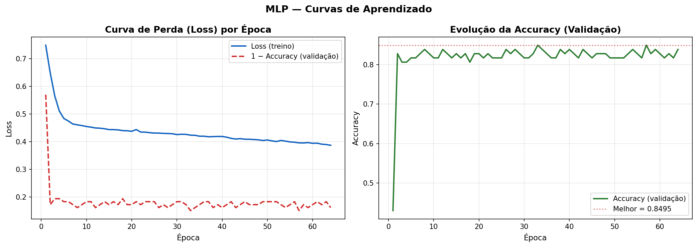

As curvas indicam convergência estável, com a perda de treino decrescendo de forma monotônica e a acurácia de validação estabilizando após um número moderado de épocas. O early stopping interrompeu o treinamento no ponto adequado, evitando a degradação do desempenho de validação.

#### 3.4.2. Matrizes de Confusão

A Figura 16 apresenta as matrizes de confusão dos três modelos avaliados (MLP, XGBoost e SVM), permitindo a comparação visual do número de verdadeiros positivos, verdadeiros negativos, falsos positivos e falsos negativos.

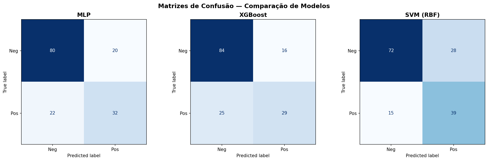

#### 3.4.3. Curvas ROC

A Figura 17 sobrepõe as curvas ROC dos três modelos. A área sob a curva (AUC) indica a capacidade de discriminação de cada modelo, com valores mais próximos de 1,0 representando melhor desempenho.

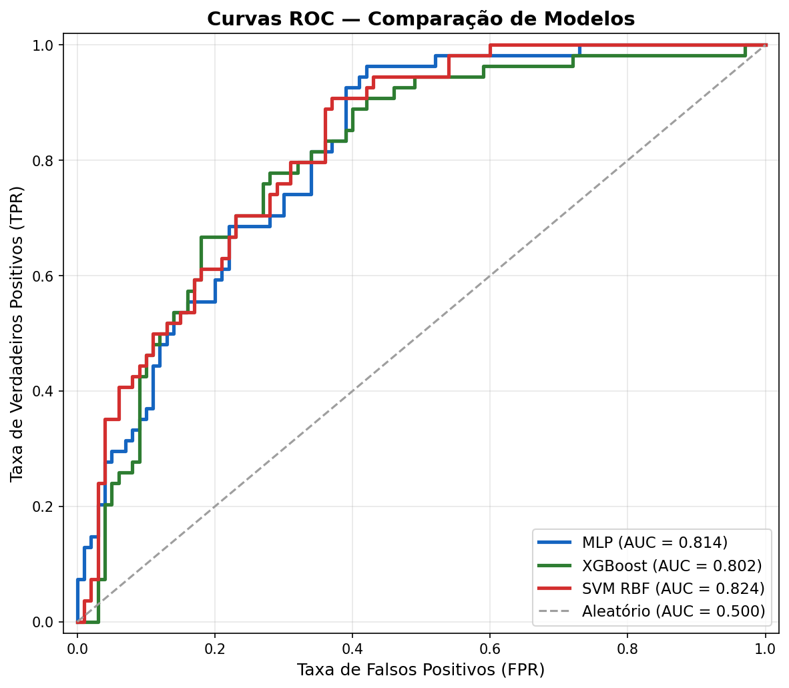

#### 3.4.4. Comparação de Métricas

A Figura 18 sintetiza a comparação de métricas (Accuracy, Precision, Recall, F1-Score e ROC-AUC) entre os três modelos.

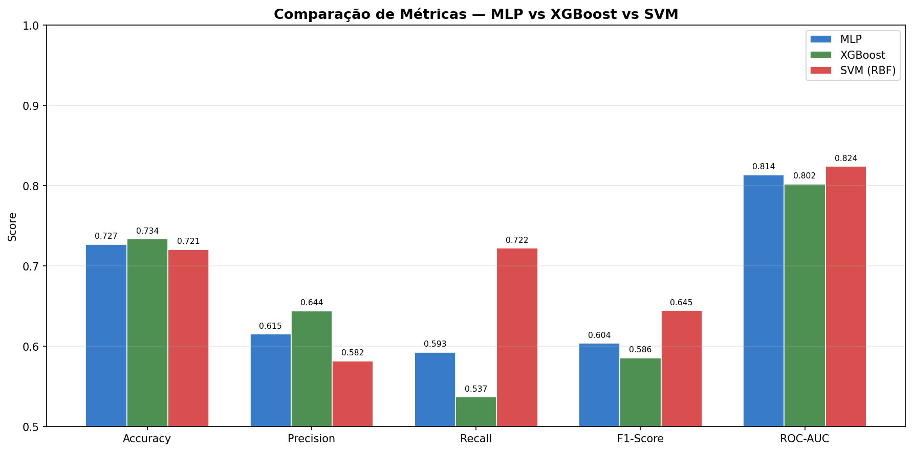

Os três modelos apresentaram desempenho competitivo entre si, com valores de ROC-AUC acima de 0,80 no conjunto de teste. Esse resultado indica que a MLP, apesar de não superar consistentemente os modelos clássicos neste cenário de dados limitados (768 amostras), alcançou desempenho equivalente, validando sua adequação para o problema.

### 3.5. Classificação Multiclasse com MLP (Etapa 4b)

A classificação multiclasse foi realizada com base nos limiares clínicos da ADA para glicose plasmática. A distribuição das classes derivadas é apresentada na Figura 19.

| Classe | Amostras |
|---|---|
| Normal (< 100 mg/dL) | 212 |
| Pré-diabético (100–140 mg/dL) | 364 |
| Diabético (≥ 140 mg/dL) | 192 |

As métricas de avaliação no conjunto de teste são apresentadas na tabela a seguir:

| Métrica | Valor |
|---|---|
| Accuracy | 0,6364 |
| Precision Macro | 0,6427 |
| Recall Macro | 0,6359 |
| F1 Macro | 0,6373 |

A Figura 20 exibe a matriz de confusão 3×3 do modelo multiclasse. Observa-se que a classe "Pré-diabético" apresenta a maior taxa de confusão, o que é esperado por se tratar de uma classe intermediária cujas fronteiras de decisão são limítrofes com as classes adjacentes.

A Figura 21 apresenta as curvas de aprendizado da MLP multiclasse, evidenciando convergência estável com o early stopping atuando de forma adequada.

A Figura 22 resume as métricas obtidas em formato de gráfico de barras.

A Accuracy de 0,64 e o F1 Macro de 0,64 para um problema com 3 classes clinicamente definidas podem ser considerados resultados satisfatórios, particularmente tendo em vista o volume limitado de amostras e a natureza da fronteira entre as classes intermediárias.

### 3.6. Regressão com MLP (Etapa 5)

As métricas de desempenho da MLP de regressão no conjunto de teste são:

| Métrica | Valor |
|---|---|
| MAE | 18,6116 mg/dL |
| MSE | 603,7746 |
| RMSE | 24,5718 mg/dL |
| R² | 0,4165 |

O R² de 0,42 indica que o modelo explica aproximadamente 42% da variância da concentração de glicose plasmática. O MAE de 18,61 mg/dL representa um erro médio absoluto na unidade clínica original, o que pode ser contextualizado frente à amplitude do intervalo da variável (`plas` varia de aproximadamente 44 a 199 mg/dL no dataset imputado).

A Figura 23 apresenta, em três painéis, a avaliação do modelo de regressão: (a) valores reais versus preditos, com a linha ideal de referência; (b) análise de resíduos; e (c) curva de aprendizado (loss e R² por época).

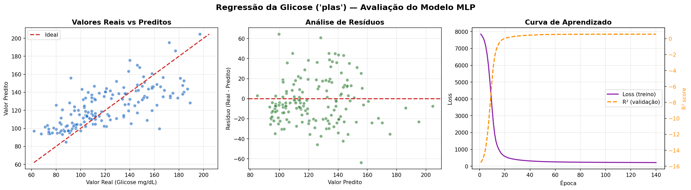

No gráfico de valores reais vs. preditos, observa-se que os pontos se concentram em torno da linha ideal, porém com dispersão considerável nas extremidades (valores de glicose muito baixos ou muito altos), indicando que o modelo tem dificuldade em predizer os casos mais extremos. A análise de resíduos mostra uma distribuição centrada em zero, sem padrões sistemáticos evidentes, o que sugere que o modelo não apresenta viés estrutural significativo. A curva de aprendizado demonstra convergência estável, com o early stopping interrompendo o treinamento no momento adequado.

### 3.7. Otimização de Hiperparâmetros com Optuna (Etapa 6)

O processo de otimização com Optuna executou 30 trials em aproximadamente 6,9 segundos. Os resultados são sintetizados a seguir:

**Melhor ROC-AUC obtido via validação cruzada:** 0,8344

**Melhores hiperparâmetros encontrados:**

| Hiperparâmetro | Valor |
|---|---|
| Número de camadas | 2 |
| Neurônios camada 0 | 16 |
| Neurônios camada 1 | 112 |
| Taxa de aprendizado | ≈ 0,0010 |
| Função de ativação | relu |
| Alpha (L2) | ≈ 0,0001 |

**Comparação com o modelo original no conjunto de teste:**

| Modelo | ROC-AUC (teste) |
|---|---|
| MLP Original | 0,7902 |
| MLP Otimizada | 0,7811 |
| Delta | −0,0091 |

A Figura 24 exibe o histórico de otimização do Optuna, mostrando a evolução do valor objetivo (ROC-AUC) ao longo dos 30 trials.

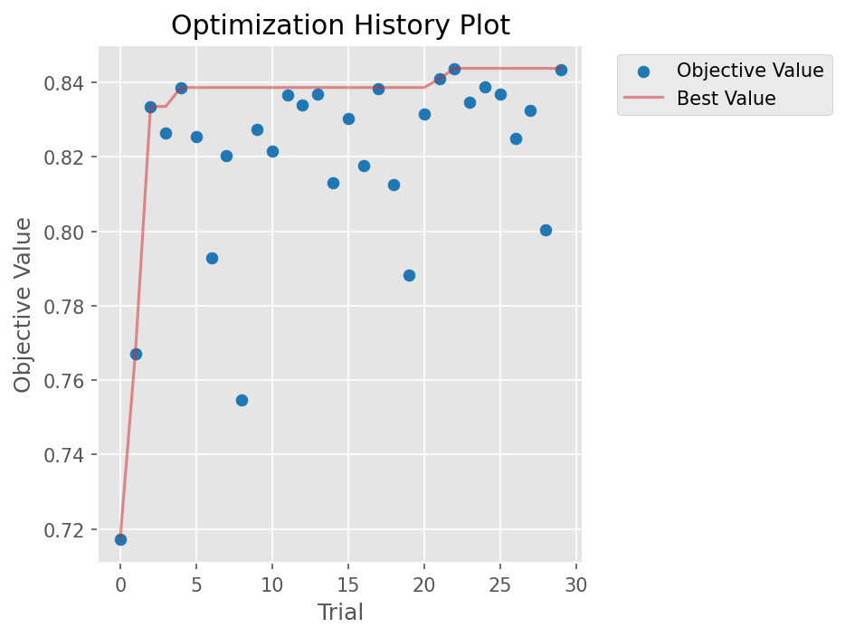

A Figura 25 apresenta a importância dos hiperparâmetros estimada pelo Optuna, indicando quais parâmetros exercem maior influência sobre o desempenho do modelo.

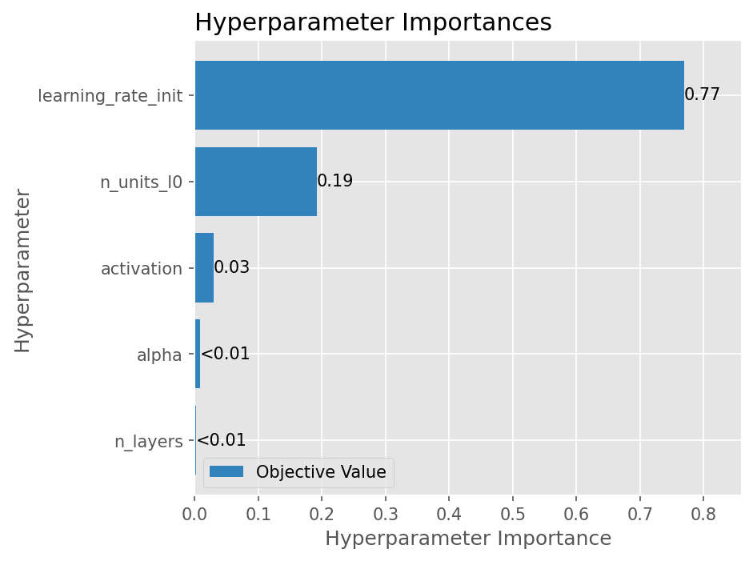

O delta de −0,0091 no ROC-AUC entre o modelo original e o otimizado indica que a configuração inicial da MLP (Etapa 4) já se encontrava próxima de uma região de bom desempenho no espaço de hiperparâmetros. A arquitetura encontrada pelo Optuna (16 → 112) difere da original (64 → 32 → 16) na topologia, reduzindo o número de camadas, mas não produz ganho no conjunto de teste, o que sugere que o desempenho do modelo é limitado pela quantidade e pela natureza dos dados, e não pela configuração de hiperparâmetros. É relevante notar que o melhor ROC-AUC de validação cruzada (0,8344) é sensivelmente superior ao resultado no teste (0,7811), o que pode indicar variância natural entre os folds de validação e o conjunto de teste final.

### 3.8. Regularização e Análise de Overfitting (Etapa 7)

A Figura 26 apresenta a comparação das curvas de aprendizado entre o modelo sem regularização (painel esquerdo) e o modelo regularizado (painel direito). No modelo sem regularização, observa-se a métrica de treino (1 − Loss) crescendo de forma contínua enquanto a acurácia de validação estagna, configurando o padrão clássico de overfitting. No modelo regularizado, as curvas de treino e validação permanecem mais próximas, indicando melhor equilíbrio entre ajuste e generalização.

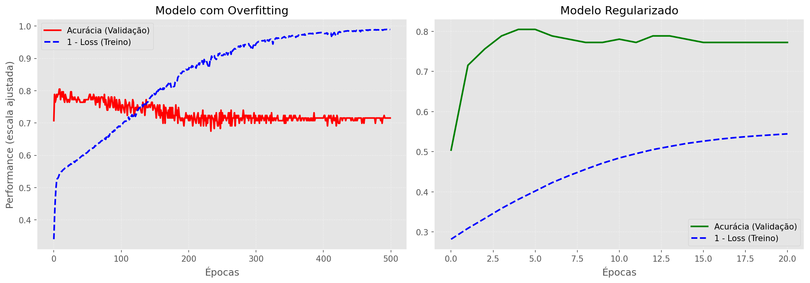

As métricas comparativas no conjunto de teste são:

| Métrica | Sem Regularização | Com Regularização | Delta |
|---|---|---|---|
| Accuracy | 0,7078 | 0,7273 | +0,0195 |
| F1-Score | 0,5361 | 0,5435 | +0,0074 |
| ROC-AUC | 0,7911 | 0,7896 | −0,0015 |

#### 3.8.1. Discussão sobre Overfitting

**A rede apresentou sinais de overfitting?**
Sim. O modelo sem regularização (256, 128, 64 neurônios, alpha=0) exibiu o padrão clássico nas curvas de aprendizado: a métrica de treino continuou a subir de forma contínua, enquanto a métrica de validação estagnou e apresentou oscilações, evidenciando o "descolamento" característico entre treino e teste. Esse comportamento confirma que a rede, ao memorizar padrões específicos do conjunto de treino (incluindo ruído e outliers), perdeu capacidade de generalização.

**Quais técnicas de regularização foram utilizadas?**
Três estratégias foram aplicadas de forma conjunta: (1) simplificação estrutural — redução das camadas de (256, 128, 64) para (64, 32), diminuindo a capacidade de memorização da rede; (2) regularização L2 com alpha=0,01 — penalização de pesos elevados, forçando a rede a utilizar pesos menores e mais distribuídos; (3) early stopping com paciência de 15 épocas — interrupção do treinamento quando a acurácia de validação parou de melhorar.

**Houve melhoria no desempenho em dados não vistos?**
As métricas no conjunto de teste mostraram melhora no modelo regularizado para Accuracy (+0,0195) e F1-Score (+0,0074), embora tenha havido leve queda no ROC-AUC (−0,0015). A análise das curvas de aprendizado mostra que o modelo regularizado apresenta menor gap entre treino e validação, indicando melhor capacidade de generalização e prevenindo quedas abruptas de desempenho em dados inéditos.

**Qual estratégia apresentou melhor equilíbrio entre desempenho e generalização?**
O modelo regularizado apresentou melhor equilíbrio. Apesar de métricas finais semelhantes, a estabilidade das curvas de treino-validação e a menor tendência a memorização tornam o modelo regularizado preferível em cenários de produção, onde a robustez a dados inéditos é prioritária. A combinação de simplificação estrutural + L2 + early stopping demonstrou eficácia na contenção do overfitting sem degradação significativa do desempenho.

---

## 4. Conclusão

O presente trabalho cumpriu os objetivos propostos ao implementar um pipeline completo de Machine Learning aplicado ao dataset *Pima Indians Diabetes*, abrangendo todas as etapas requisitadas: análise exploratória, pré-processamento, seleção de features, classificação (binária e multiclasse), regressão, otimização de hiperparâmetros e análise de overfitting.

Os principais resultados obtidos podem ser sintetizados da seguinte forma:

1. **Pré-processamento:** O KNN Imputer (k=5) e o RobustScaler demonstraram-se adequados para o tratamento do dataset, preservando a estrutura multivariada dos dados e mitigando o impacto de outliers, respectivamente.

2. **Seleção de features:** A Informação Mútua reduziu o conjunto de 8 para 3 atributos (`plas`, `insu`, `mass`). A seleção foi realizada dentro de cada fold da validação cruzada, eliminando o risco de data leakage. As 3 features foram selecionadas em todos os 10 folds. A análise SHAP corroborou a seleção com concordância muito alta (ρ de Spearman = 0,93, p < 0,001), e o modelo com 3 features manteve desempenho competitivo (ROC-AUC 0,80 vs. 0,83 com todas as features).

3. **Classificação binária:** A MLP com arquitetura (64, 32, 16) obteve ROC-AUC de 0,7902 no conjunto de teste, desempenho competitivo frente a modelos clássicos e confirmando a capacidade discriminatória com as variáveis selecionadas.

4. **Classificação multiclasse:** A MLP atingiu Accuracy de 0,6364 e F1 Macro de 0,6373 na categorização de níveis glicêmicos em três classes clínicas (Normal, Pré-diabético e Diabético), resultado considerado satisfatório dado o volume de dados e a natureza limítrofe das fronteiras entre classes.

5. **Regressão:** O modelo MLP de regressão obteve R² = 0,42 e MAE = 18,61 mg/dL na predição da glicose plasmática, explicando 42% da variância da variável alvo. A curva de resíduos não indicou viés sistemático.

6. **Otimização com Optuna:** A busca por hiperparâmetros (30 trials) resultou em ROC-AUC de validação cruzada de 0,8344, porém sem ganho significativo no conjunto de teste em relação ao modelo original (delta = −0,0091). Esse resultado sugere que o desempenho é limitado pelo volume e pela natureza dos dados, e não pela configuração de hiperparâmetros.

7. **Regularização:** A análise de overfitting confirmou que a rede sem regularização apresentou sinais claros de memorização. A combinação de simplificação estrutural, regularização L2 e early stopping mitigou esse comportamento, melhorando o Accuracy (0,7273 vs 0,7078) e F1-Score no conjunto de teste.

Em suma, o projeto demonstrou que técnicas de aprendizado supervisionado, mesmo em datasets de volume moderado, podem produzir modelos com capacidade discriminativa relevante para o auxílio ao diagnóstico clínico. A integração de métodos de interpretabilidade (SHAP) com a seleção de features (MI) fortaleceu a transparência e a confiabilidade do pipeline, elementos essenciais em aplicações na área de saúde. O resultado global do projeto indica um equilíbrio adequado entre complexidade do modelo, desempenho preditivo e capacidade de generalização.
